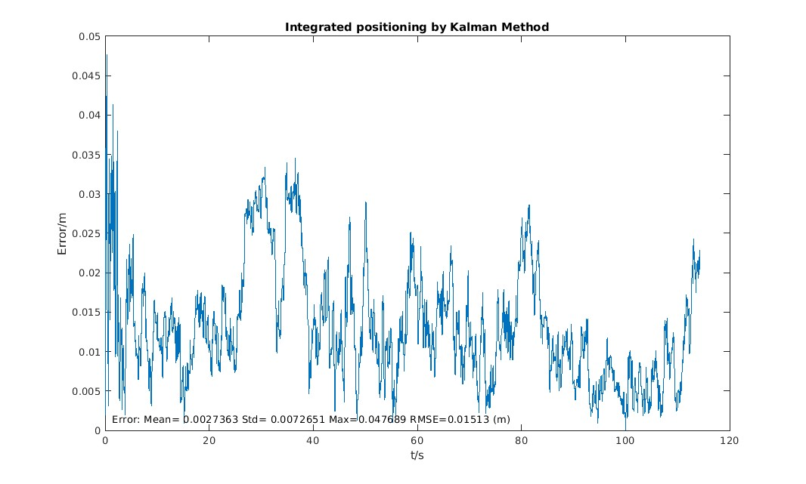
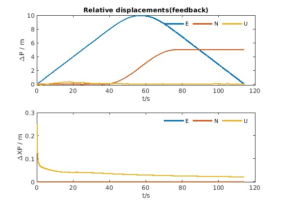
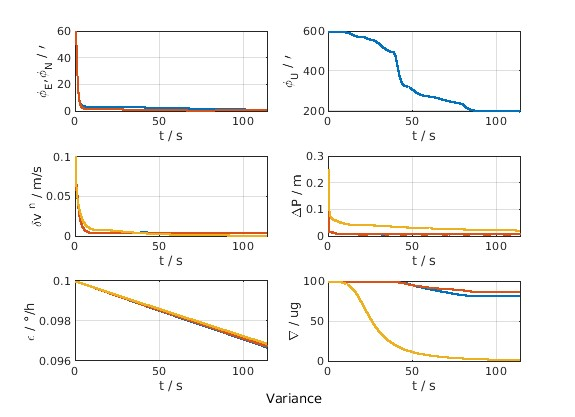

# UWB-and-IMU-Fusion
This is a very high-precision integrated navigation software Kalman Filtering method based on IMU and UWB information with MATLAB. In this project, measurements of the inertial measurement unit (IMU) and Ultra-wideband (UWB) are simulated and used to calculate the positions of the robots moving along a given path. The angle and position errors of the robot are also calculated to show the performance.

## Get started
To run this software, please run the `IMUandUWB.m` in MATLAB.

## Results
The results are given as follows.
### The localization trajectory of the robot

### Performance

## References and acknowledgments
Gongmin Yan, Precise Strapdown Inertial Navigation System ([PSINS](http://www.psins.org.cn/kydm)) Toolbox for Matlab, Northwestern Polytechnical University.
